# CP3 — Cross Platform Application Development

## 👩‍💻 Identificação

- **Nome:** Pamella Souza da Silva Ferreira  
- **RM:** 566172  
- **Turma:** 2CCPH  

---

# 📚 Índice de Exercícios

| Aula | Exercício | Pasta |
|------|-----------|-------|
| 03 | Cartão de Visita Digital | [aula03-cartao-visita](aula03-cartao-visita) |
| 04 | Contador de Hidratação | [aula04-contador-hidratacao](aula04-contador-hidratacao) |
| 05 | Meu Perfil | [aula05-meu-perfil](aula05-meu-perfil) |
| 06 | MemoList | [aula06-memolist](aula06-memolist) |
| 07 | Mini Loja | [aula07-mini-loja](aula07-mini-loja) |
| 09 | Cadastro Completo | [aula09-cadastro-completo](aula09-cadastro-completo) |
---

# ▶ Como Rodar os Projetos

Clone o repositório:

```bash
git clone https://github.com/SEU-USUARIO/fiap-cpad-cp3
```

Entre na pasta desejada:

```bash
cd fiap-cpad-cp3/aula03-cartao-visita
```

Instale as dependências:

```bash
npm install
```

Execute o projeto:

```bash
npx expo start
```

Depois:
- pressione `a` para abrir no Android Emulator
ou
- escaneie o QR Code com o Expo Go

---

# 📱 Aula 03 — Cartão de Visita Digital

Aplicação desenvolvida utilizando componentes core do React Native e estilização com `StyleSheet`.  
O app funciona como um mini Linktree pessoal, contendo foto remota, informações acadêmicas e links profissionais.

## 🛠 Tecnologias praticadas

- JSX
- Componentes Core
- StyleSheet
- Estilização no React Native

## 📸 Print do App

<div align="center">
  
</div>
---

# 💧 Aula 04 — Contador de Hidratação

Aplicação de controle de hidratação desenvolvida com `useState` e `useEffect`.  
O projeto contabiliza copos de água consumidos e exibe feedback visual ao atingir a meta diária de hidratação.

## 🛠 Tecnologias praticadas

- useState
- useEffect
- StyleSheet
- Manipulação de estado

## ✨ Diferenciais implementados

- Ícones personalizados
- Design inspirado em aplicativos

## 📸 Print do App

<div align="center">
  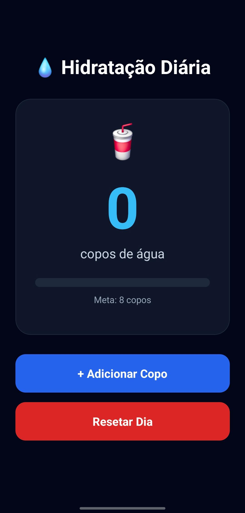
  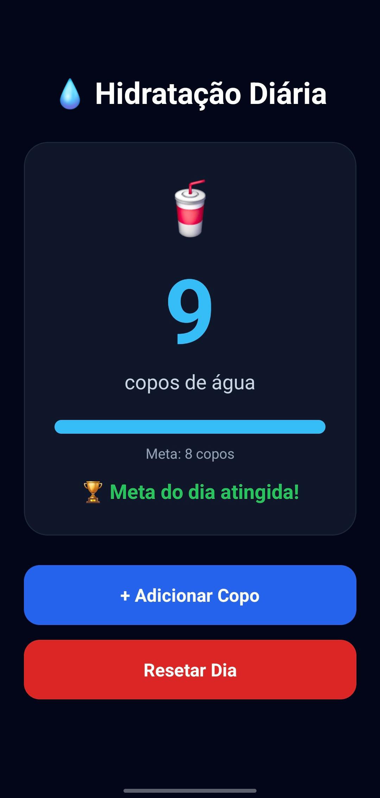
  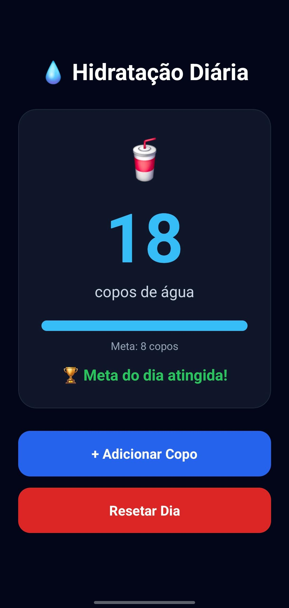
</div>


---

# 👤 Aula 05 — Meu Perfil

Mini aplicativo com navegação entre telas utilizando Expo Router.  
O projeto apresenta informações pessoais, tecnologias favoritas da área de dados e navegação entre Home e Perfil.

## 🛠 Tecnologias praticadas

- Expo Router
- Navegação entre telas
- Flexbox
- Componentização

## ✨ Diferenciais implementados

- Cards personalizados
- Melhor hierarquia visual

## 📸 Print do App

<div align="center">
  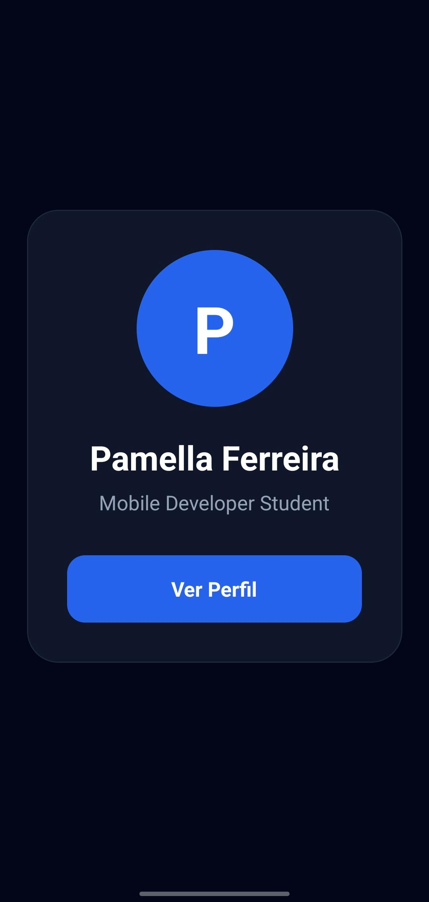
  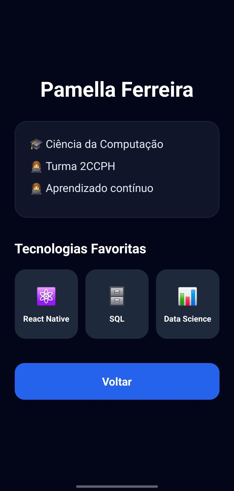
</div>

---

# 📝 Aula 06 — MemoList

Aplicação de lista de tarefas com persistência local utilizando AsyncStorage.  
O projeto permite adicionar tarefas, marcar como concluídas, salvar automaticamente e limpar completamente a lista.

## 🛠 Tecnologias praticadas

- AsyncStorage
- FlatList
- Switch
- Persistência de dados
- Componentização

## ✨ Diferenciais implementados

- Tela inicial
- Contador de tarefas
- Organização em componentes

## 📸 Print do App

<div align="center">
  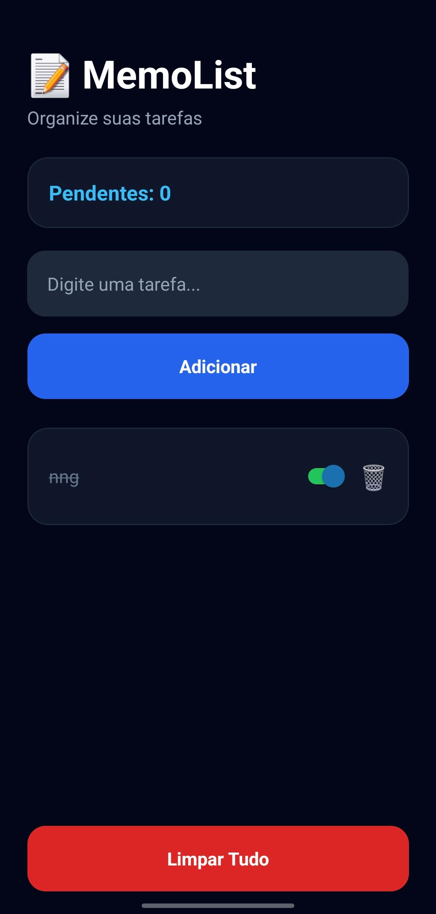
  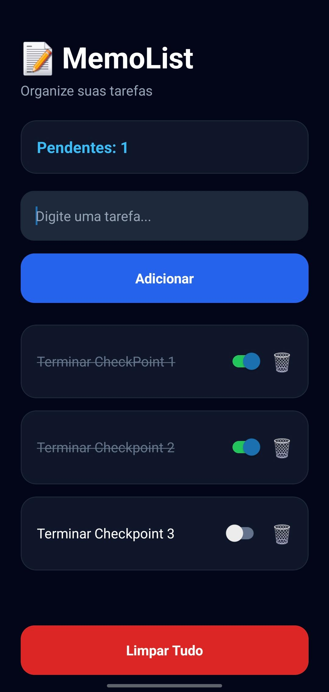
  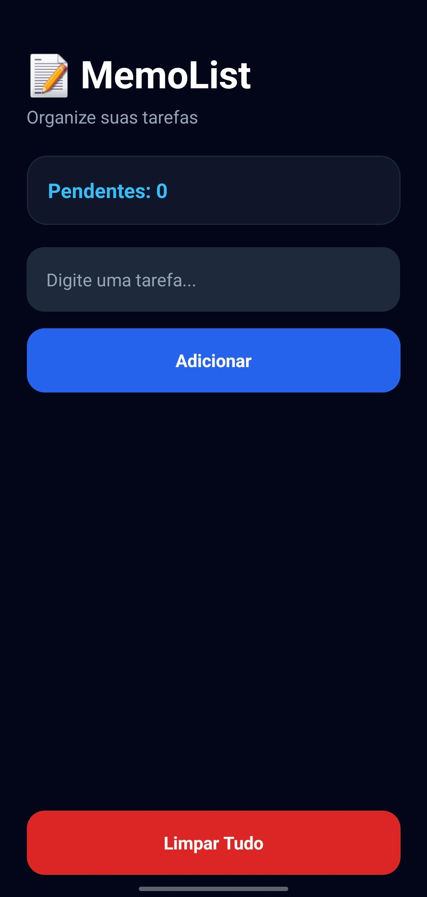
</div>

---

# 🛒 Aula 07 — Mini Loja

Mini e-commerce desenvolvido utilizando Context API para gerenciamento de estado global.  
O projeto possui catálogo de produtos, tela de detalhes, carrinho em tempo real e cálculo automático do valor total.

## 🛠 Tecnologias praticadas

- Context API
- Estado Global
- Navegação
- Mock de dados
- Componentização

## ✨ Diferenciais implementados

- Tela de detalhes dos produtos
- Interface inspirada em apps reais
- Layout de loja virtual

## 📸 Print do App

<div align="center">
  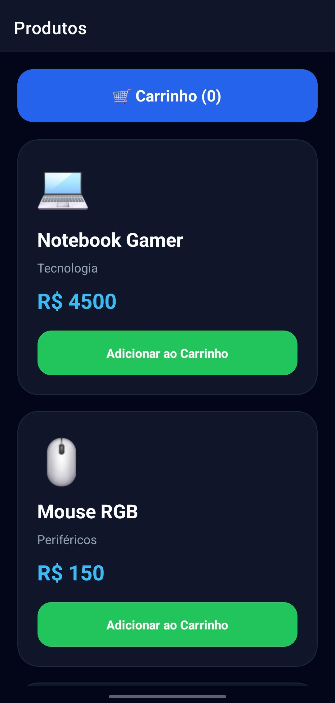
  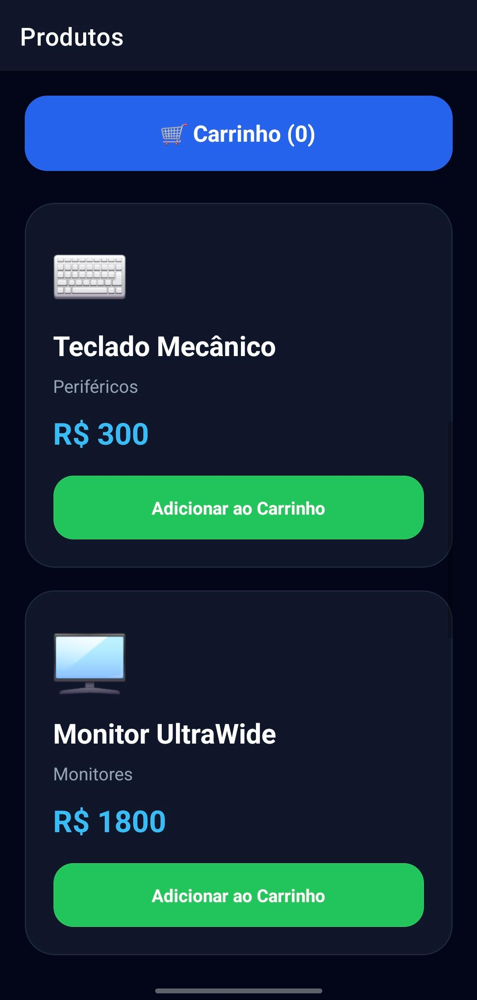
  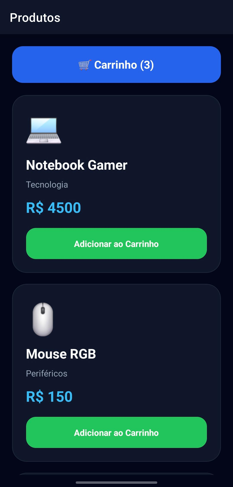
  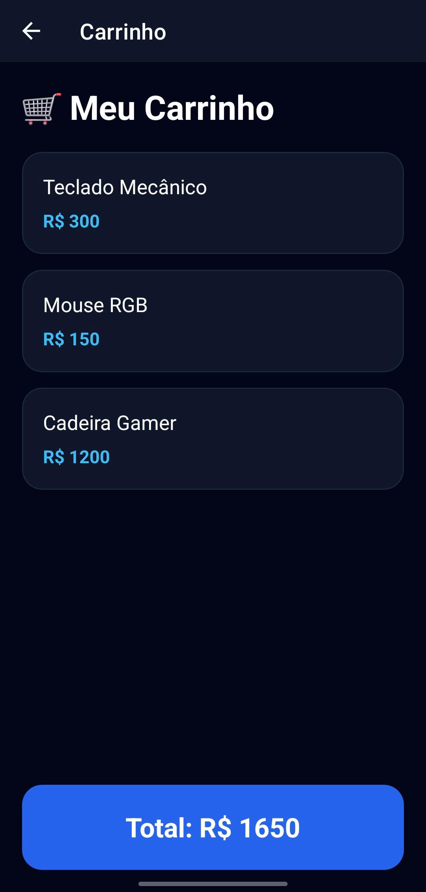
</div>


---

# 📋 Aula 09 — Cadastro Completo

Sistema de cadastro desenvolvido com validações avançadas, máscaras e feedback visual inline.  
O projeto inclui múltiplas telas, chips de perfil e loading durante o envio.

## 🛠 Tecnologias praticadas

- useRef
- Máscaras de formulário
- Validação inline
- KeyboardAvoidingView
- Manipulação de formulários

## ✨ Diferenciais implementados

- Tela inicial
- Tela de listagem de cadastros
- UX aprimorada
- Interface moderna e profissional

## 📸 Print do App

<div align="center">
  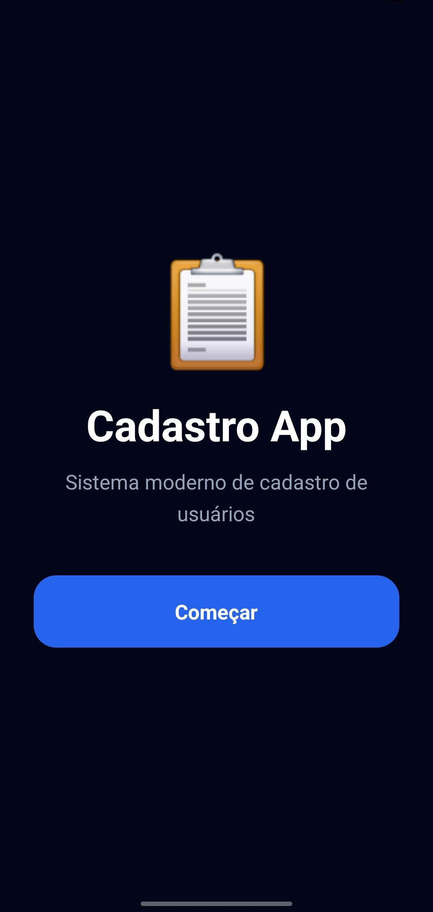
  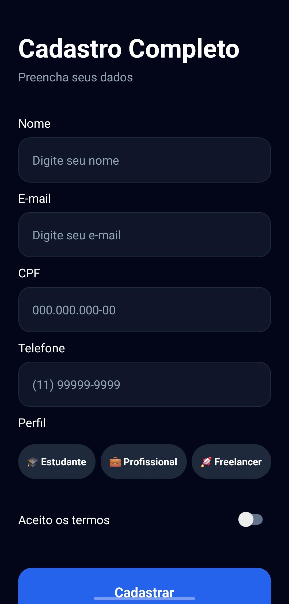
  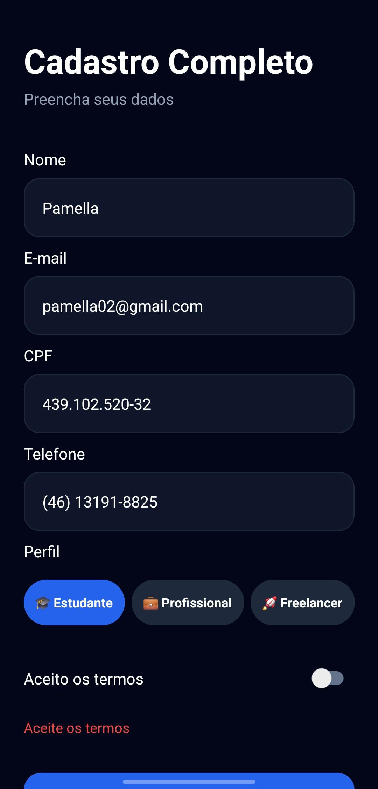
  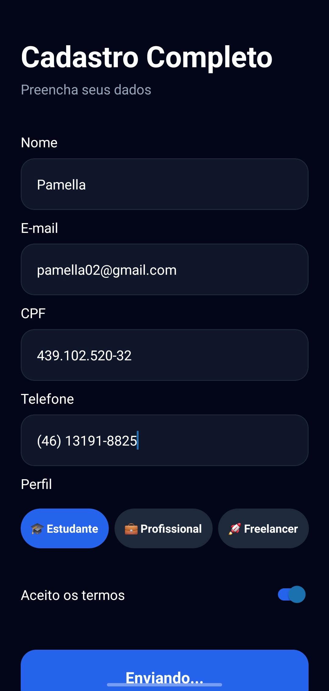
  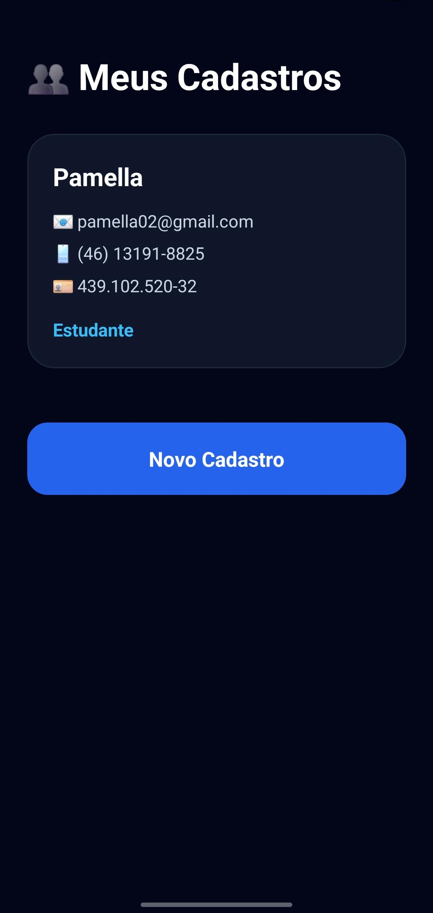
</div>


---

# 🚀 Reflexão Final

Ao longo da disciplina consegui evoluir bastante no desenvolvimento mobile utilizando React Native e Expo.  
Os temas mais desafiadores foram navegação, Context API e persistência de dados, mas também foram os que mais contribuíram para meu aprendizado.

O checkpoint permitiu consolidar conceitos importantes de interface, componentização, gerenciamento de estado e experiência do usuário, criando aplicações mais organizadas e próximas de projetos reais.
